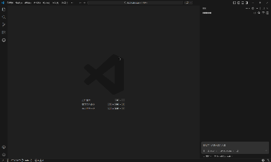

# MCP 连接器

MCP 连接器是安装在嘉立创 EDA 中的客户端扩展，需要与 VS Code/Cursor 侧的嘉立创 EDA MCP 服务端配套使用。接入后，你可以直接在 Copilot、Cursor Chat、Claude Code 等 AI 助手中检查原理图、分析电路、辅助设计电路方案，并让 AI 在嘉立创 EDA 中完成相关操作。

> 这套方案的链路是：EDA -> WebSocket (Bridge) -> stdio (MCP) -> AI 大模型。
> B 站教程视频：https://www.bilibili.com/video/BV11QwuzxEDy/

项目地址：https://github.com/sengbin/JLCEDA-MCP

## 安装

**服务端**和**客户端**两个扩展都需要安装。

> VS Code 内置 Copilot 和 Cursor 内置 Chat 在安装服务端扩展后会自动配置 MCP 服务；其他聊天工具如 Claude Code、Codex，需要手动配置 MCP 服务。

### 客户端（嘉立创 EDA）

**从扩展管理器安装（推荐）：**

1. 打开嘉立创 EDA，进入扩展管理器。
2. 搜索"MCP连接器"并安装。

**从 GitHub 安装包安装：**

1. 打开发布页：https://github.com/sengbin/JLCEDA-MCP/releases/tag/package
2. 下载 `.eext` 安装包，在嘉立创 EDA 中导入并安装。

### 服务端（VS Code / Cursor）

服务端文档：[嘉立创 EDA MCP 服务端 README](https://github.com/sengbin/JLCEDA-MCP/blob/main/mcp-server/README.md)

**从扩展商店安装（推荐）：**

打开 VS Code 或 Cursor 扩展视图，搜索"嘉立创 EDA MCP"并安装。

- VS Code 扩展商店：https://marketplace.visualstudio.com/items?itemName=chengbin.jlceda-mcp-server
- Cursor（Open VSX）：https://open-vsx.org/extension/chengbin/jlceda-mcp-server

## 状态说明

连接设置页面展示两行状态，每秒自动刷新：

- **第一行（桥接状态）**：活动页面显示"已连接"；待命页面显示"当前活动客户端：xxx"；连接失败显示"连接失败"。
- **第二行（WebSocket 状态）**：正在连接时显示"连接中"；连接成功后显示"当前客户端：xxx"；连接失败时显示具体错误原因。

连接失败后系统会自动重试。

## 注意事项

1. 客户端与服务端必须同时安装。
2. 如果修改了服务端监听端口，需要在连接器设置页同步更新地址。
3. 多页面并行时，只有活动角色页面执行任务，待命页面属于正常状态。
4. 状态异常时优先重启嘉立创 EDA 与 VS Code/Cursor。

## 常见问题

### 聊天里看不到工具怎么办？

请在聊天客户端确认该 MCP 服务已被信任，并检查工具开关是否开启。

### AI 读不到当前图纸内容怎么办？

EDA 页面可能未桥接成功，请回到连接设置页确认连接状态是否正常。

### 保存地址后仍无法连接？

请确认服务端扩展已安装并运行，连接地址与侧边栏显示值完全一致。

## 许可证

本扩展采用 [Apache License 2.0](LICENSE) 许可证。
